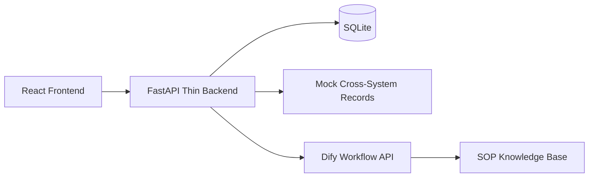

# Architecture

## System Flow

## Runtime Responsibilities

- Frontend
  - 创建案例
  - 展示证据、规则命中、AI 解释、人工确认和时间线
- Backend
  - 生成 `case_id`
  - 管理案例状态
  - 拉取 mock 跨系统记录
  - 运行规则引擎
  - 代理 Dify API
  - 保存 AI 输出和审计日志
- Dify
  - 接收标准化上下文
  - 压缩上下文
  - 检索 SOP
  - 输出结构化 JSON

## State Machine

- `created`
- `context_ready`
- `analyzing`
- `waiting_review`
- `completed`
- `rejected`
- `needs_more_info`
- `failed`

## Rule-First Boundary

系统不允许 LLM 越过以下边界：

- 不得创造不存在的字段
- 不得覆盖规则命中的事实
- 不得直接执行金额或状态变更
- 证据不足时必须明确要求人工确认

